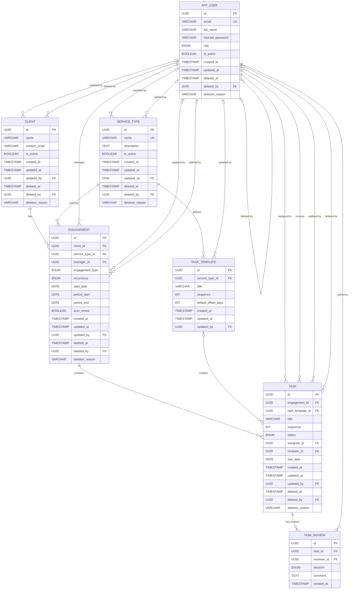

# Technical Design Note

## 1. Architecture

**Frontend** — React + TypeScript SPA (Vite), talks to the backend only through a typed `api/endpoints.ts` client. Route-level guards (`RequireAuth`) mirror backend role rules for navigation only; the backend is the actual authority. State is per-page (`useApi` hook + a small `ReferenceContext` for shared lookups like users/clients); no global store.

**Backend** — FastAPI, fully async. Routes are thin: they resolve the current user, call a service function, and return its result. All business logic and authorization decisions live in `app/services/*.py`, never in routes.

**Database** — PostgreSQL (Neon), accessed via SQLAlchemy 2.0 async ORM over `asyncpg`. Every mutable table has a soft-delete column (`deleted_at`) and an audit trail written by a **database trigger**, not application code (see §2), so audit history can't be bypassed by a code path that forgets to log.

**Authentication** — JWT access/refresh pair, enforced via FastAPI `Depends`, never inline `if` checks in a route body (see §4).

**Deployment** — Vercel (frontend, static SPA rewrite to `index.html`) + Render (backend, free-tier web service; build step runs `alembic upgrade head` before start so schema migrations are never a manual step) + Neon (Postgres). Render's health check hits `/health`. An external uptime pinger (UptimeRobot) keeps the free-tier backend from cold-sleeping. CORS is pinned to the deployed frontend origin.

## 2. Database Schema / ERD

**Entities**: `AppUser`, `Client`, `ServiceType` → `TaskTemplate`, `Engagement`, `Task`, `TaskReview`. Every entity above the leaf level (`Client`, `ServiceType`, `TaskTemplate`, `Engagement`, `Task`) also has a matching `<table>_audit` table, populated only by a trigger.

- **Relationships**: `Engagement` belongs to a `Client`, a `ServiceType`, and a manager (`AppUser`). `Task` belongs to an `Engagement`, optionally to a `TaskTemplate` (null = ad-hoc task, not generated from a template), has an optional `assignee` and a mandatory `reviewer` (both `AppUser`). `TaskReview` is an append-only history row per review decision on a `Task`.

- **Primary / foreign keys**: all tables use a UUID primary key. FKs: `TaskTemplate.service_type_id → ServiceType`, `Engagement.{client_id, service_type_id, manager_id}`, `Task.{engagement_id, task_template_id, assignee_id, reviewer_id}`, `TaskReview.{task_id, reviewer_id}`.

- **Important constraints**:
  - `task_reviewer_is_not_assignee` (check) — a task's assignee and reviewer can never be the same person; nobody approves their own work.
  - `task_review_comment_required_when_negative` (check) — a review comment is mandatory unless the decision is `approved`.
  - `engagement_recurring_has_period` / `engagement_period_ordered` / `engagement_start_matches_period` (checks) — a recurring engagement must carry a recurrence + a well-ordered period; a one-time engagement must carry neither.
  - **`engagement_unique_period`** — a partial unique index on `(client_id, service_type_id, period_start) WHERE period_start IS NOT NULL AND deleted_at IS NULL`. This single constraint is the entire duplicate-generation guard (see §5) — enforced by Postgres, not application code.
  - `task_template_sequence_unique` — unique `(service_type_id, sequence)`, deferrable, so a batch reorder of templates doesn't trip uniqueness mid-transaction.

- **Relevant indexes**: `task_engagement_active_idx (engagement_id) WHERE deleted_at IS NULL`, `task_assignee_status_idx (assignee_id, status) WHERE deleted_at IS NULL`, `task_deleted_idx (deleted_at) WHERE deleted_at IS NOT NULL`, `task_review_task_idx (task_id, created_at)`, and one `<table>_audit_record_idx (record_id, changed_at DESC)` per audit table. All hot-path indexes are partial (scoped to the live or deleted subset) rather than full-table.

## 3. Backend Design

- **API/service structure**: one router per resource (`tasks`, `engagements`, `users`, `service_types`, `dashboard`, `auth`) under `app/api/routes/`, each delegating to a matching `app/services/*_service.py`. A route never touches the ORM directly for anything beyond its own coarse auth dependency.
- **Where validation happens**: shape/type validation is Pydantic v2 schemas (`app/schemas/*.py`) at the request boundary — a malformed payload never reaches a service. Relational/business validation (does this client exist and is it active, does a recurring engagement carry a recurrence, is the reviewer really a manager) is service-layer, because it needs a DB read the schema layer doesn't have. The database is the last validation layer for anything a race condition could violate (uniqueness, check constraints) — services catch the resulting `IntegrityError` and translate it to a domain error rather than let a 500 through.
- **Where business logic lives**: exclusively in `app/services/`. Routes contain no `if`/business rule beyond picking which service function to call; this is what makes the visibility/authorization rules in §4 auditable in one place per resource.
- **Error handling**: four `DomainError` subclasses (`NotFoundError`→404, `PermissionDeniedError`→403, `ConflictError`→409, `AuthenticationError`→401) directly subclass `HTTPException`, so a service just `raise`s the domain error and FastAPI's built-in handling maps it — no bespoke global exception handler needed. Pydantic failures fall through to FastAPI's default 422. A caller trying an action that would violate a row's current state (e.g. approving a task not in `ready_for_review`) gets a 409 naming the reason, never a raw stack trace or a generic 500.

## 4. Authentication & Authorization

- Access tokens (15 min TTL) carry the user's `role` claim, so authenticating a request costs one signature verification and no DB read. Refresh tokens (7 days) carry no role — every refresh re-reads the user, which is the only point a deactivation or role change actually takes effect (bounding staleness to the 15-minute access-token lifetime).
- Enforcement is two-layered, and deliberately not collapsed into one:
  1. **Coarse, route-level**: a small family of FastAPI dependencies (`require_admin`, `require_manager`, `require_any_role`) built from one `require_roles(*roles)` factory. These reject before a handler body runs at all.
  2. **Fine, relational, service-level**: "is this actor *this row's* reviewer/assignee/manager" cannot live in a route dependency because it needs the row. Every mutating service function re-derives this from the loaded row and the actor's role — e.g. a manager may only patch a task they are the named reviewer of; only an admin may reassign a task's reviewer; a task's assignee-only actions (start/submit/wait-for-client/resume) require the actual assignee or an admin, not "any manager".
  3. **List/read visibility** follows the same per-role split: a team member sees only what's assigned to them; a manager sees only what they review (tasks) or manage (engagements); an admin sees everything. A row a user isn't allowed to see returns **404, not 403** — a 403 would itself confirm the row exists.

## 5. Recurring Task Generation

- **Generation**: `generate_tasks_for_engagement` creates one `Task` per `TaskTemplate` on the engagement's service type, at generation time, copying title/sequence/due-date onto the task rather than joining the template live — so editing a template later never rewrites history on already-generated tasks. `create_next_period` computes the next period, inserts the new `Engagement`, generates its tasks, and commits — all as **one transaction**.
- **Duplicate prevention**: enforced at the database level by the `engagement_unique_period` partial unique index (client_id, service_type_id, period_start), not by an application-side existence check. This is deliberate: an app-level "does this period already exist" check-then-insert has a race window under concurrency; a unique index doesn't.
- **Running it twice**: the second call's INSERT violates `engagement_unique_period`, raising `IntegrityError`. The service catches it, rolls back, re-queries for the existing row, and returns it with `created=False` instead of raising — running generation twice is a no-op that returns the same engagement, not a duplicate and not an error.
- **Partial failure**: because engagement creation and its tasks are one transaction, a crash mid-generation leaves **no partial engagement** — either the engagement and all its tasks exist, or neither does. At the batch level, the scheduled job (`run_recurrence_generation`) opens **one new session/transaction per due engagement**, not one for the whole run: a single broken engagement (bad service type, constraint violation) is caught, logged, and skipped without rolling back or blocking every other client's engagement in the same run, and without holding locks for the run's full duration.
- The daily job (APScheduler, 02:00 UTC, `max_instances=1, coalesce=True`) calls the exact same service function the manual "generate next period" button calls, so the scheduled and manual paths cannot drift apart.

## 6. Workflow Rules

Task status is a fixed state machine (`TRANSITIONS` in `task_service.py`): `not_started → assigned` (via staffing) `→ in_progress → ready_for_review → completed`, with `waiting_for_client` and `changes_requested` as detours back into `in_progress`, and an explicit `reopen` back from `completed`. Anything not in the table is refused with a 409 naming the current status — there is no implicit/default transition.

Enforcement is split by action type:
- **Review actions** (`approve`, `request-changes`, `reopen`) require the task's *named reviewer* or an admin — never "any manager." Approving one's own work is explicitly blocked even for an admin who happens to be the assignee.
- **All other actions** (`start`, `submit`, `wait-for-client`, `resume`) require the actual *assignee* or an admin — a manager is not the worker and cannot drive these on the assignee's behalf.
- The row is locked `FOR UPDATE` before the current status is checked and rewritten, closing the race where two concurrent requests (a double-click, two tabs) could both pass the check and both write — the realistic failure mode for an approve action.

## 7. Tests

18 backend test files (pytest + pytest-asyncio, real Postgres, no mocked DB):

- `test_auth.py` — password hashing, token claims, login success/failure.
- `test_authorization.py` — token required, coarse role gating, any-role read access.
- `test_users.py` — user creation, duplicate email, short-password rejection.
- `test_service_types.py` — service type + template creation, duplicate sequence rejected, negative offset rejected, non-manager forbidden.
- `test_engagement_lifecycle.py` — soft-delete cascade to tasks, delete then relist, restore + cascade, restore conflict (409), delete requires a reason, team member forbidden from mutating, immutable-field rejection on PATCH.
- `test_generation.py` — template-based task generation, one-time due-date resolution, duplicate-period rejected, two one-time engagements allowed, recurring-without-recurrence rejected.
- `test_recurrence.py` — next-period creation, **running generation twice creates the period only once**, `auto_renew=false` excluded from generation, scheduled-job run is idempotent, **a failed generation leaves no partial engagement behind**.
- `test_scheduler.py` — job registers correctly, runs cleanly against an empty due-set.
- `test_task_management.py` — assignment status side effects, reassignment mid-flight, unassign-mid-flight rejected, ad-hoc task sequencing, deleted task blocks the workflow and restores to its prior status.
- `test_workflow.py` — full happy path, invalid transition rejected, cross-user action blocked, DB check constraint enforced, self-approval blocked, comment required on request-changes, changes-requested round trip, only the named reviewer (or admin) may approve.
- `test_visibility_and_assignment.py` — task read visibility per role (assignee/reviewer/team member/manager/admin), engagement list/detail visibility per role, reviewer reassignment restricted to admin, nonexistent-user references rejected.
- `test_dashboard.py` — per-status counts, team member sees only their own tasks, deleted tasks excluded.
- `test_audit.py` — trigger writes an audit row on insert/update and records the acting user.
- `test_integrity_error_discrimination.py` — an unrelated `IntegrityError` is never mislabeled as the specific conflict a caller expected.
- `test_models.py`, `test_periods.py` — enum completeness, pure period-arithmetic functions.
- `test_health.py` — liveness endpoint.

## 8. Production Considerations at 5M Tasks

- **Database indexes**: current indexes are partial and targeted (active tasks by engagement, by assignee+status, deleted tasks by date), which is the right shape — but at this scale I'd add a covering index for the dashboard's per-status counts and revisit whether `task_review_task_idx` needs to include `decision` for the review-history views.
- **Pagination**: `GET /tasks` and `GET /engagements` currently return unbounded lists. This is the first thing that breaks — needs cursor-based pagination (keyset on `(due_date, id)` or `(created_at, id)`) rather than `OFFSET`, since offset pagination degrades linearly with table size.
- **Background jobs**: APScheduler in-process is fine at current scale but ties job execution to a single web instance and its uptime; at 5M rows the recurrence job's per-engagement session loop is already the right shape (isolated failure, no long-held locks) but would benefit from being extracted to a proper job queue (e.g. a managed cron worker) so it survives a web-instance restart mid-run and scales independently of request traffic.
- **Dashboard queries**: `dashboard_service` currently issues nine separate `SELECT count(*)` queries per load. At scale this should collapse into one query using `count(*) FILTER (WHERE ...)` per metric, and likely a materialized/periodically-refreshed summary table if the dashboard is hit often, rather than aggregating 5M live rows per page view.
- **Logging/monitoring**: today, failures in the recurrence job are caught and `logger.exception`'d per engagement with no external alerting. At scale this needs structured logging with request/job correlation IDs, and an alert on the recurrence job's failure count (not just a log line) since a silently-failing engagement means a client's tasks simply never get created.

## 9. Trade-offs

1. **JWT claims over per-request DB reads for authorization.** Chose to embed `role` in the access token rather than look up the user on every request, trading a bounded staleness window (up to 15 minutes) for one fewer DB round trip per authenticated request — acceptable because a demoted/deactivated user's access token can't outlive its short TTL.
2. **A database unique index, not an application check, for duplicate-period prevention.** An app-level "does this exist" check before insert is a race under concurrency (two schedulers, or a manual click racing the cron job); the partial unique index makes the database itself the single source of truth, and the service layer's job is just to interpret the resulting `IntegrityError` cleanly instead of trying to prevent it.
3. **Soft delete + DB-trigger audit trail, not application-level logging.** Every mutating table keeps its row on delete and gets its audit history written by a trigger reading `updated_by`, not by a code path that could be skipped by a new call site. The cost is an extra table and a slightly heavier write per mutation; the benefit is that audit completeness doesn't depend on every future service function remembering to log.
